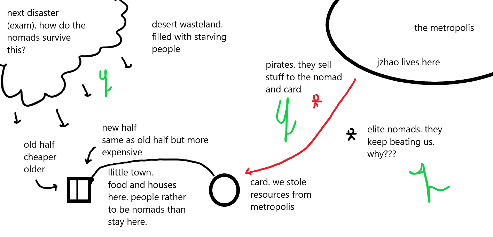

*in reference to [christian's article](https://spicata.github.io/theTown.html)*

*what follows is a visualised welcome, where interjections will be notated via brackets.*

Welcome! As a founding member of the town, it is my honour to welcome you to our fine establishment.

It's tough living in the desert(school). Gusts of wind(assessments) and even mighty sandstorms(exams) have ravaged the land beyond recognition. 

Yet, we still stand. Slightly bruised, but flourishing none-the-less.

You may be curious how this little settlement in the middle of nowhere came to fruition. Well, it started with two.

Me, and [my good friend Christian](https://spicata.github.io/mint-fresh-notes/) saw what others didn't. While they saw this place as a barren wasteland(school) where people go to die, we saw this as a utopia in the waiting. A land of safety, freedom, and refuge from the terrible sandstorms that run amok. 

So we set up here. You can see [his house](https://spicata.github.io/mint-fresh-notes/) and [his store](https://spicata.github.io/) right around the corner.

I'll be truthful with you. There were actually 4 founders. It's just that two of them(mace, osacr) haven't been seen in a while. They may be dead(given up), they may have moved out of town(focus on academics). Who knows? Their houses are locked, so we can't check on them. And I dare not commit breaking and entering.

Their houses are still visible from the town square. You can see [mace's](https://macesnotes.netlify.app/) on the hill over there, right next to [osacr's](https://notes.notmario.net/).

In the past few days or so, we've been incredibly lucky. My (jzhao's(this is not an interjection this is the truth i literally stole jzhao's template)) house designs seem to have piqued the interests of some nearby nomads(non-website owners, who live in the desert). In fact, my good friend from work [Thomas](https://nottacoz.github.io/jacaranda/) has emigrated to our town for a life away from the desert. His house is right next to mine! Luckily for us, Thomas is a great architect(coder), and his house is already looking good.

Luckily for the town but unluckily for me, my "colleague" has also set up shop here. His calls himself the ["Reaper"](https://grim4reaper.github.io/Year11Notes/), and he's kinda salty that I don't spend my free time helping him build his own house. Yeah, he's kinda a jerk. Unfortunately for me he's also my neighbour.

I got an odd request from an old friend of mine. He also decided to take refuge in the town, but currently he's living in a shell of a house. His name is [jlee](https://supaqwerty.github.io/year-11-notes/). Hopefully he starts putting some walls up(website content) in time for the upcoming sandstorm.

I'm an entrepreneurial individual. I sell tea and spaghetti.

You may have heard that my house is quite volatile. That it has burnt down twice. This is fake news. Absolute rubbish.

You may have also heard that we are discriminatory. That we refuse people who want to set up Victorian-esque houses(wix websites) in our town. This is absolutely true. They are not allowed here. Maybe we will reconsider in the future. Probably not.

Anyways, another friend of mine set up shop in this town of ours. But, he kinda owes a lot of debt to this random company in America. I think his house is co-owned by said company. He lives far off from the centre of the town. He's often forgotten. His name is [dasindu](https://pale-ladybug-133.notion.site/Nuclei-moment-2c89b8b95cc74fd6bab60300753d48e8).

That's all of the houses in town as of now. Let's talk about something else.

The founding idea of this town is it would be a place of refuge for the people in the desert. "Nomads"(non-website people), we call them. Yet, there are some nomads off in the distance that are quite unique. They seem to be relaxed, much like us. They have made the desert their home. They are thriving(elite students(pranaf)). How do they do it? We'll never know. 

There's a city, quite far off in the north of our town. The legendary Jzhao lives there. He's kind of a celebrity here, being the main source of the town's architecture. 

Living in an isolated town has its downsides. Our town thrives via a thinly maintained pathway between us and the city. In the middle is a little supply depot. I think the locals call it "CARD". I have a personal membership to the depot, but for those who don't in the town, they have to survive by making their own food(school resources)

This "CARD" is maintained by its connection to the city. We buy our supplies(school resources) from there. Rumour has it these supplies are actually couriered by "pirates"(pirates, like seriously). Scary, but it's best not to think about it.

We haven't had much interaction with the government(school admin). We don't think they know we exist yet. But once they catch word of pirates supplying us they may get a little cross. Personally, having structured the trade contracts myself, it's my firm belief that the "pirates" that have been operating in the area are not at all involved in the operation of "CARD". But you can never know.

Just some context about how the town is structured. The 4 founders live in what's called the old side of the town. Dasindu also lives here, but he's a bit far back. The new settlers(Thomas, Jlee, Reaper, etc.) reside in what's called the new side of the town.

All citizens of the town offer their own unique wares for your perusal. You may stay as long as you like, and just so you know it's all free. I think.

There's plenty of space in the new side of town. Please, if you're sick of struggling in the desert, come to us. We welcome you with open arms. We'll even help you in building your house. I'm known to help out occasionally, same as Christian.

Maybe someday we'll be able to live like the nomads. To be one with the harsh desert environment.

*With love(but not for dasindu),*

*Ed, a founder of The Town*
