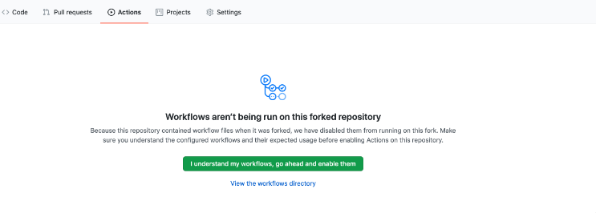
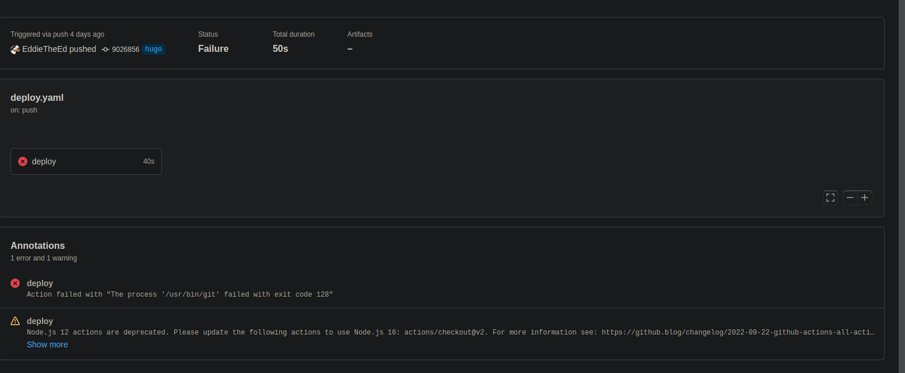

Hello!

Perhaps you are reading this because you think my website looks cool and you want something like it.

First of all, I am a Linux user that converted from Windows (sadly) so a bunch of the things I had to do (esp. trying to get around school wifi not liking ssh) will probably not apply to you.

I should give an outline of what the final set-up will be:
- Obsidian vault where you can write your notes
- A github pages website sponsored by JZhao

All credits go to [Jacky Zhao](https://twitter.com/_jzhao?lang=en), he made literally all the code. All I am is a middleman between you and him, here to offer my guidance. (I have suffered)


> [!CAUTION] IMPORTANT!
>
> If you encounter any bugs, **please email them to me** so I can look into them.

> [!CAUTION] DONT BE LIKE TAJ!
>
> Don't store the file in a onedrive.

## Acquire an obsidian vault
This *should* be self explanatory, I am going to assume you will use obsidian first and then use the website, hence I will outline how to import your data to fit with the website code.

1. Go to the [obsidian download](https://obsidian.md/download), and download it.


2. Open obsidian. There will probably not be a "content" vault set up already, as it is not there by default.


Congratulations! You have downloaded obsidian. You may consider just getting into it before you make the website, but if you do so you will have to place its content inside the "content" folder, **including the .obsidian folder**, and then use obsidian's "open another vault" and open the **content folder** within the repo. This will make sense later. However, I suggest making the website first.

## Create the website repository
First of all, you need a github account, as we will be using github pages.

1. Go to [github](https://github.com/) and make a new account.


2. Once you have made your account, go to [quartz](https://github.com/jackyzha0/quartz). While **logged in**, create a new repo using the template.


3. Name the repo whatever you like. It probably doesn't matter. Ensure you **include all branches**, AND you **keep it public!!!** Github Pages will **only** work for repos that are public.


Congrats! On your account, the repository with the name you gave it should be there. Now we need to download it onto your computer. I will assume you are using **windows.** However, as a result I will not be able to assist you. I can vaguely tell you what to do, however. Feel free to email me any questions

## Downloading the repository

1. Download Github desktop
2. Add your account
3. Open the repository online
4. Press the green code section
5. Open with Github Desktop
6. Clone, and specify whatever location you want

You now have quartz on your windows computer!!! :)

## Setting Up Obby inside the repository

1. Open the file explorer to where the repository you just downloaded is. The folder should look something like this.


2. Go back to your obsidian, (open a new vault if required), and **open folder as vault**. Select the **content** folder of the repository.

3. Add your notes here! This vault is now directly connected to your online repository. Not only does that mean it is safe in the chance that you lose your data (corrupt disc or something), but you can update your website via obsidian.

3a. There are many ways to update website via obsidian. However, I suggest using obsidian git(a plugin).

## Configuring the repository
First of all, we need to setup quartz so the pages will work. I suggest reading [JZhao's Guide](https://quartz.jzhao.xyz/notes/hosting/) on setting up these things. I'll essentially paraphrase and add things that may be needed.

1. Go to the actions tab. Activate workflows.


2. Go to the settings tab, then go to the **pages** tab.
- Make sure the branch is **master** and going to root. If you have  a custom domain set it up here, but its not necessary.


## Configuring the clone
Ok, but to personalise your website we need to modify some things directly in the repository folder. 

1. Open the folder as before. It should look as it did before.


I will now list the things that should be changed.
- config.toml: (if you are using custom domain)
```
baseURL = "https://<YOUR-DOMAIN>/"
```
OR if you are using github pages:
```
baseURL = "https://<YOUR-GITHUB-USERNAME>.github.io/<REPO-NAME>/"
```

- /.github/workflows/deploy.yaml: (if you are using custom domain)
```
- name: Deploy  
  uses: peaceiris/actions-gh-pages@v3  
  with:  
	github_token: ${{ secrets.GITHUB_TOKEN }} # this can stay as is, GitHub fills this in for us!
	publish_dir: ./public  
	publish_branch: master
	cname: <YOUR-DOMAIN>
```
OR if you are using github pages:
```
cname: <YOUR-USERNAME>.github.io
```

## Making it yours

Alright! Upon your first push, the website will come to life. However, you might notice that it looks very much like the default site. So it's time to customise it, to your liking!

Once again, here's a list of the things that can be changed:
- data/config.yaml:
```
# The name to display in the footer
name: Jacky Zhao

# whether to globally show the table of contents on each page
# this can be turned off on a per-page basis by adding this to the
# front-matter of that note
enableToc: true

# whether to by-default open or close the table of contents on each page
openToc: false

# whether to display on-hover link preview cards
enableLinkPreview: true

# whether to render titles for code blocks
enableCodeBlockTitle: true 

# whether to render copy buttons for code blocks
enableCodeBlockCopy: true 

# whether to render callouts
enableCallouts: true

# whether to try to process Latex
enableLatex: true

# whether to enable single-page-app style rendering
# this prevents flashes of unstyled content and improves
# smoothness of Quartz. More info in issue #109 on GitHub
enableSPA: true

# whether to render a footer
enableFooter: true

# whether backlinks of pages should show the context in which
# they were mentioned
enableContextualBacklinks: true

# whether to show a section of recent notes on the home page
enableRecentNotes: false

# whether to display an 'edit' button next to the last edited field
# that links to github
enableGitHubEdit: true
GitHubLink: <REPO-URL>/tree/hugo/content

# whether to render mermaid diagrams
enableMermaid: true

# whether to use Operand to power semantic search
# IMPORTANT: replace this API key with your own if you plan on using
# Operand search!
search:
  enableSemanticSearch: false
  operandApiKey: "REPLACE-WITH-YOUR-OPERAND-API-KEY"
  operandIndexId: "REPLACE-WITH-YOUR-OPERAND-INDEX-ID"

# page description used for SEO
description:
  <DESCRIPTION>

# title of the home page (also for SEO)
page_title:
  "<TITLE>"

# links to show in the footer
links:
  - link_name: Twitter
    link: https://twitter.com/_jzhao
  - link_name: Github
    link: https://github.com/jackyzha0
```

- static/icon.png
	- Changing this will change the icon that appears to the left of your website name. 

- assets/styles/custom.scss
	- To change the colours of things.

## TLDR 
That should be it! If you find anything confusing or you want to add any tips, please feel free to email me.

## Troubleshooting

1. Headings in the tables of content are scuffed


This is an easy (if not cumbersome) fix. This means, in obsidian you are using the top level heading(i.e. one hashtag).

This, for some reason, screws with quartz. Probably cause the heading is converted to h1, which is weird cause the website expects there to only be 1 h1. Who knows.

You have to change the hierarchy, so that h2 is the highest heading you write in the .md file (two hashtags).

2. Actions returning exit code 128


This means your computer doesn't have the right access tokens. ~~I suspect this only affects Linux computers.~~ I have been informed it affects windows as well. I'm guessing github must've changed something recently.

SOLUTION:
1. Open the settings tab
2. Open the actions tabs, then the general tab.
3. Under the "Workflow permissions" header, select the **read and write permissions** option. This ensures the GITHUB_TOKEN in the deploy action can push to the website. 
4. Save.
